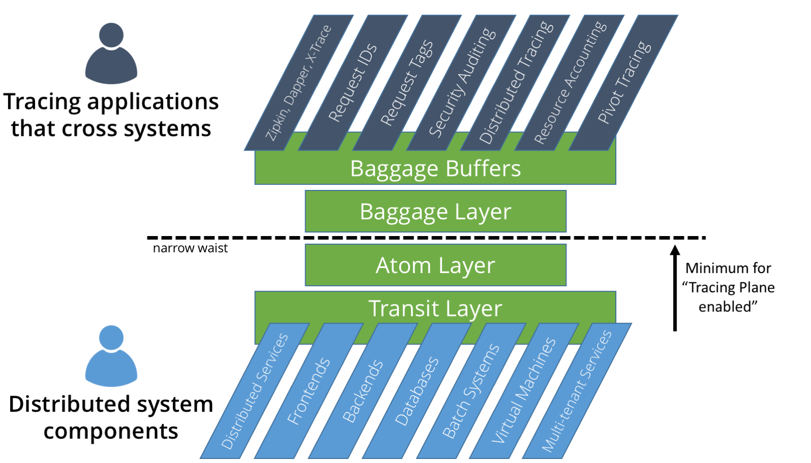

#  The Tracing Plane and Baggage #

## 1 Introduction ##

The Tracing Plane is a layered design for context propagation in distributed systems.  The tracing plane enables interoperability between systems and tracing applications.  It is designed to provide a simple "narrow waist" for tracing, much like how TCP/IP provides a narrow waist for the internet.

Baggage is our name for **general purpose request context** in distributed systems, and Baggage is implemented by the Tracing Plane.  Though many systems already have request contexts -- e.g., Go's [context package](https://golang.org/pkg/context/); Span contexts in [Zipkin](https://github.com/openzipkin/zipkin), [OpenTracing](http://opentracing.io/) and [Dapper](https://research.google.com/pubs/archive/36356.pdf); request tags in [Census](https://github.com/grpc/grpc/tree/master/src/core/ext/census); etc. -- none of them are *general purpose*.  What this means is that if I instrument my distributed system to pass around Zipkin span contents, then later wish to use Census,  I must **reinstrument everything** in order to pass around Census tags.  That *sucks*.

This repository contains our Java reference implementation for the Tracing Plane and Baggage.  This is an active research project at Brown University by [Jonathan Mace](http://cs.brown.edu/people/jcmace/) and [Prof. Rodrigo Fonseca](http://cs.brown.edu/~rfonseca/).  It is motivated by many years of collective experience in end-to-end tracing and numerous tracing-related research projects including [X-Trace](https://www.usenix.org/legacy/event/nsdi07/tech/full_papers/fonseca/fonseca.pdf), [Quanto](https://www.usenix.org/legacy/event/osdi08/tech/full_papers/fonseca/fonseca.pdf), [Retro](http://cs.brown.edu/people/jcmace/papers/mace15retro.pdf), [Pivot Tracing](http://cs.brown.edu/people/jcmace/papers/mace15pivot.pdf).  You can also check out our research group's [GitHub](http://brownsys.github.io/tracing-framework/).  Keep an eye out for our research paper on Baggage, which will appear later in 2017!

### Useful Links ###

Javadoc for this repository: [jonathanmace.github.io/tracingplane/doc/javadoc/index.html](https://jonathanmace.github.io/tracingplane/doc/javadoc/index.html)

### Table of Contents ###

* [1 Introduction](#1-introduction)
* [2 Overview of The Tracing Plane](#2-overview-of-the-tracing-plane)
	* [2.1 Tracing Plane Outer Layers](#21-tracing-plane-outer-layers)
		* [2.1.1 Transit Layer (for System Developers)](#211-transit-layer-for-system-developers)
		* [2.1.2 Baggage Buffers (for Tracing Applications)](#212-baggage-buffers-for-tracing-applications)
	* [2.2 Tracing Plane Inner Layers](#22-tracing-plane-inner-layers)
		* [2.2.1 Atom Layer](#221-atom-layer)
		    * [Lexicographic Merge](#atom-layer-lexicographic-merge)
		    * [Overflow](#atom-layer-overflow)
		* [2.2.2 Baggage Layer](#222-baggage-layer)
		 * [Atom Prefixes](#atom-prefixes)
		 * [Maps](#maps)
		 * [Lexicographically Comparable Variable-Length Integers (LexVarInts)](#lexicographically-comparable-variable-length-integers-lexvarints)
		 * [Trees](#trees)
		 * [Overflow](#overflow)
		 * [Further](#further)
* [3. Building and Compiling](#3-building-and-compiling)
* [Old notes and thoughts](#old-notes-and-thoughts)

#### TODO ####

* I need more details TODO (FAQ for researchers, tracing application devs, system devs, and curious observers)
* Getting started - downloading, prerequisites, and building TODO
* Simple example - baggage buffers TODO
* Tutorial - instrument your system TODO
* Overview of APIs for each layer TODO
* Project Status TODO

## 2 Overview of The Tracing Plane ##

The Tracing Plane has four layers, illustrated in green in the figure below.  Depending on who you are, your entry point to the Tracing Plane differs.  

System developers use the Transit Layer APIs to instrument their system to pass baggage around.  

Tracing application developers use the Baggage Buffers IDL to generate contexts and APIs for their tracing application.  

In the middle, the Atom and Baggage layers provide generic interfaces that together enable a multitude of different kinds of tracing applications to coexist.

The above figure illustrates how the transit and atom layers are the minimum requirement for a system to be 'Tracing Plane enabled'.  The Atom Layer is a *very* simple, straightforward, and generic representation of context, with simple rules for how to propagate it.

The Baggage Layer defines the Baggage Protocol, a way to lay out data for the atom layer.  The Baggage Buffers layer provides an IDL for defining custom contexts in an easy way, and automatically generates the correct Baggage Protocol representation of the custom context.

## 2.1 Tracing Plane Outer Layers ##

There are two target audiences for the Tracing Plane.

First is the **System Developers** who write components of the distributed system and must instrument their system to pass contexts around.  The **Transit Layer** at the bottom of the stack is the entry point for this audience.

Second is **Tracing Application Developers** who write tracing applications such as Zipkin, X-Trace, and many others.  These developers want to pass metadata through many system components, across application, process, and system boundaries.  The **Baggage Buffers** layer at the top of the stack is the entry point for this audience.

## 2.1.1 Transit Layer (for System Developers) ##

The **Transit Layer** has just one purpose: abstract the task of system instrumentation so that it only has to be done once.  System instrumentation is the most laborious part of tracing.  You have to modify every system component to make sure request contexts are passed around -- for example, passed to new threads when they're created, included in continuations and thread pool queues, serialized to RPC headers, etc.

Many systems *already have this kind of instrumentation* -- they already pass around request IDs, span contexts, tags, or other metadata.  However, in every case we have ever seen, the metadata passed around is tightly bound to the system, making it difficult or impossible to easily extend it to add new fields or change its behavior.  

The Transit Layer is an **instrumentation abstraction** that makes no attempt to interpret the contents or meaning of the baggage being carried.  This lets you **reuse existing instrumentation** whenever you want to deploy a new tracing application.  Instrumentation reuse overcomes an *enormous* barrier to entry -- we cannot overstate how useful this is!

To the transit layer, baggage is only ever an opaque object or byte array.  When system developers instrument their system, they only need to consider where requests go -- they do not need to think about how to manipulate and update request contexts while requests execute.

The Transit Layer API is a set of static methods of the class `Baggage` ([Javadoc](https://jonathanmace.github.io/tracingplane/doc/javadoc/edu/brown/cs/systems/tracingplane/transit_layer/Baggage.html)).  These methods provide a simple means to set and remove Baggage in a thread-local variable, create copies, and serialize Baggage.

See the (not yet written sorry) Transit Layer Tutorial for examples and usage of Transit Layer APIs.

## 2.1.2 Baggage Buffers (for Tracing Applications) ##

Baggage Buffers is an [Interface Definition Language](https://en.wikipedia.org/wiki/Interface_description_language) for generating tracing context interfaces.  It makes it super easy to specify data that you want to be propagated in your system.  Baggage Buffers is similar to protocol buffers in terms of syntax and usage -- first, you write a baggage buffers definition, eg [`xtrace.bb`](https://github.com/JonathanMace/tracingplane/blob/master/baggage-buffers-examples/src/main/baggage/xtrace.bb):

	package edu.brown.xtrace;
	
	bag XTraceMetadata {
		fixed64 taskId = 1;
		set<fixed64> parentEventIds = 2;
	}

The Baggage Buffers Compiler is a command line tool that generates source files

	bbc --java_out="target/generated_sources" src/main/baggage/xtrace.bb
	
The compiler generates source files with interfaces for accessing Baggage, eg [`XTraceMetadata.java`](https://github.com/JonathanMace/tracingplane/blob/master/baggage-buffers-examples/target/generated-sources/edu/brown/xtrace/XTraceMetadata.java) ([Javadoc](https://jonathanmace.github.io/tracingplane/doc/javadoc/edu/brown/xtrace/XTraceMetadata.html))

    public class XTraceMetadata implements Bag {
        public Long taskId = null;
        public Set<Long> parentEventIds = null;
        ...
        public static XTraceMetadata get();
        public static void set(XTraceMetadata xTraceMetadata);
        ...
    }

Within the generated source files are two important accessor methods.  These accessor methods interface with the baggage being carried in the current thread (controlled by the transit layer).  `get()` accesses the baggage set in the current Thread, finds, and returns the `XTraceMetadata` bag.  Similarly, `set(..)` sets the `XTraceMetadata` bag being carried in the current thread's Baggage.

That's all you need to be able to start propagating `XTraceMetadata`!  A service in one part of a large, complicated system can toss some `XTraceMetadata` into a Baggage instance, and will faithfully receive it back (possibly merged with other XTraceMetadata instaces).

See the (not yet written sorry) Baggage Buffers Tutorial and Language Guide for examples and usage of Baggage Buffers.  For now [`example.bb`](https://github.com/JonathanMace/tracingplane/blob/master/baggage-buffers-examples/src/main/baggage/example.bb) shows the supported fields and types (though numerous types are specified but not yet implemented eg counters, clocks, min, max, avg, sum, etc.... they will be by february)

## 2.2 Tracing Plane Inner Layers ##

Under the covers, Baggage Buffers interacts with the Baggage Layer, which defines a protocol for seamlessly composing potentially many contexts that may be present from different tracing applications.

In order to do this and also make it extremely simple for systems to propagate contexts, the baggage layer builds on top of the atom layer.  The logic of the atom layer is extremely simple, but sufficient to support everything described so far.

## 2.2.1 Atom Layer ##

As described in [Section 2.1.1](#211-transit-layer-for-system-developers), the Transit Layer abstracts the task of system instrumentation so that it only has to be done once.  To the transit layer, and to system developers using Transit Layer APIs, baggage is only ever an opaque object or byte array.  As a result, the transit layer **delegates** logic for the following two tasks:

  1. Dividing and combining contexts when executions branch and rejoin.  If baggage is just a cryptic array of bytes [ 0x08, 0xAF, ...], how are you supposed to take two different arrays and merge them into one?
  2. Enforcing capacity restrictions on baggage.  Again, if baggage is just a cryptic array of bytes, how can you ditch some of the bytes if the array is too big?

The **Atom Layer** provides a simple implementation of branch, join, serialize and trimming logic for the Transit Layer and is designed to support our principle goal: a **general purpose request context**.  That is, the atom layer must support the logic of many different tracing applications which can be quite varied -- for example, you might want to do a set-union of tags in census when two execution branches join, or take the greater of two values in pivot tracing.

We absolutely want to **avoid** having to inspect and interpret baggage contents on a per-application basis, for example, it is insufficient for the Atom Layer to just call up to each tracing application.  This would *kill* our ability to easily deploy new tracing applications, because every time we deploy a new tracing application we would have to update **every** system component with new rules for handling the contexts.  By analogy, it would be like expecting every router on the internet to be able to understand the contents of every packet being routed for every protocol.  

Instead, we want to be able to pass *any* contexts through our system and have them emerge in a coherent, consistent way.  This means no interpretation of the payload -- just a single representation and one set of rules for branching, joining, serialization, and trimming.

The **Atom Layer** provides this generic solution -- an underlying context representation that supports all use cases.  It represents baggage as an **array of atoms** where an atom is **an array of bytes**.  Atoms can have arbitrary length.  The Atom Layer implements operations as follows:

* Serialization and Deserialization: length prefix the bytes of each atom
* Branch: each branch receives its a copy of the atoms with no modifications
* Join: merge the two arrays of atoms using **lexicographic comparison** (more below)
* Trim: drop atoms from the **end** of the array of atoms until size requirement is met; then append the **overflow marker** (more below)

#### Atom Layer: Lexicographic Merge ####

Lexicographic merge is the cornerstone of the atom layer.  Atom arrays are arbitrary -- they do not need to be sorted and there are no requirements on lengths.  It is important for the atom layer to maintain the atom ordering in arrays, however, especially when merging two arrays.  To merge two arrays, it traverses them performing atom-wise comparison.  To compare two atoms is done **lexicographically**: starting from the leftmost bit, the raw bits are compared until one is found to be less than the other.  The lesser atom is added to the output and its atom array is advanced.  If the two atoms are exactly the same then the atom is added to the output and *both* atom arrays advance.  If one atom is a prefix of the other atom, then the shorter atom is considered to be lesser.

Lexicographic comparison is like doing an alphabetic comparison, but on bytes (e.g., `h` is less than `hell` is less than `hello`, just as `0` is less than `0001` is less than `00010`).  (Note: in reality, atoms are constrained to multiples of 1 byte, so a 5-bit atom is actually not allowed; we just use it here for simple examples).  The following examples demonstrate lexicographic merge:

##### Example 1 #####

* A = [ `0010`, `1100`, `0101` ]
* B = [ `0`, `0001`, `1111` ]
* merge(A, B) = [ `0`, `0001`, `0010`, `1100`, `0101`, `1111` ]

##### Example 2 #####

* A = [ `0010`, `1100`, `0101`, `1111` ]
* B = [ `0`, `0001`, `110000`, `1111` ]
* merge(A, B) = [ `0`, `0001`, `0010`, `1100`, `0101`, `110000`, `1111` ]

##### Why Lexicographic Merge? #####

If A and B are both sorted, then lexicographic merge produces a sorted array as output.  Additionally, if an element exists in both A and B, then it won't be duplicated in the output.  This scheme, in essence, gives us the primitive of a set, with set union as the merge behavior.

* A = [ `0000`, `000111`, `1000`, `111` ]
* B = [ `000111`, `001`, `1100`, `111` ]
* merge(A, B) = [ `0000`, `000111`, `001`, `1000`, `1100`, `111` ]

Taking this one step further, we could implement a rudimentary map by saying that the first byte of every atom is the map key and the subsequent bytes are the map value.  This would actually be a multimap, since you would be able to map several values to the same key.

Going further still, remember that there is no requirement for the arrays to be sorted.  If small atoms follow large atoms, then we are guaranteed for them all to follow each other in the output.  For example:

* A = [ `1010`, `0000`, `000111`, `0111` ]
* B = [ `1011`, `000111`, `001`, `0111` ]
* merge(A, B) = [ `1010`, `0000`, `000111`, `0111`, `1011`, `000111`, `001`, `0111` ]

Notice in this example that even though some atoms exist in both A and B, such as `000111`, the output array contains `000111` twice.  Lexicographic merge only skips duplicates if they are directly compared.  In the example above, A's `000111` is never compared to B's `000111` so there is no opportunity for deduplication.  This is a **good** thing!  It enables the Baggage Layer later on to implement arbitrary tree-structured data.

#### Atom Layer: Overflow ####

Since baggage is generic and dynamic, it is possible for baggage to continue accumulating data until it is very large in size.  For example, tracing application developers might get liberal with the tags they add to the baggage, causing baggage size to continuously grow until it is too large.  This is a problem for systems that have strict limits on the baggage size they are willing to propagate.

The atom layer implements trimming in a simple way -- to trim baggage to a specific size limit, atoms are dropped from the **end** of the baggage until eventually baggage is within the size limit.  Then the **Overflow Marker** is appended to the end of the baggage.  The Overflow Marker is a zero-length atom, used to indicate that Overflow occurred.  Overflow is the term we use for when Baggage must be trimmed because it is too large.

Since the Overflow Marker is a zero-length atom, it is less than every other atom (similar to how the empty string is less than all other strings).  This means that the overflow marker 'retains' its position when arrays of atoms are merged.  We can always infer based on the position of the overflow marker which atoms could have been trimmed and which definitely were not.

#### Further Reading ####

The Atom Layer [Javadoc](https://jonathanmace.github.io/tracingplane/doc/javadoc/edu/brown/cs/systems/tracingplane/atom_layer/AtomLayer.html) has a decent level of commenting.

## 2.2.2 Baggage Layer ##

The Baggage Layer specifies and implements the **Baggage Protocol**.  The Baggage Protocol specifies the data format and layout for atoms such that:

* Different tracing applications can put atoms in the baggage and get them back without interference from other tracing applications
* Tracing applications can utilize a variety of data types including primitives, sets, maps, counters, clocks, and **any state-based conflict-free replicated datatype**.
* If overflow occurs, we know exactly which tracing applications were affect and which were not.  This means we can also implement *inexact* datatypes such as approximate counters.

There are several important components to the Baggage Protocol outlined here.

### Atom Prefixes ###

The first byte of all Baggage Protocol atoms is the atom's *prefix* (similar to an IP packet header).  The first bit of a prefix is the atom type: 0 is a data atom and 1 is a header atom.  The overflow atom is also supported.

* **Data Atoms** Data atoms do not currently use the remaining bits of the prefix.  The subsequent bytes of a data atom are just an arbitrary payload that is not interpreted by the baggage layer.
* **Header Atoms** Header atoms use the remaining bits of the prefix as described in the next section.  The subsequent bytes of a header atom are used as a *key*.

### Maps ###

The very first bit of any data atom is a 0, therefore data atoms are **always** lexicographically less than header atoms.  This gives us the basis for implementing maps.  To create a mapping for a key to a value, simply create a header atom containing the key, then a data atom containing the value.  For example, suppose we want to map the key `01001000` to the value `11111111 11110001`.  We would create the following atoms:

A = [`10000000 01001000`,`00000000 11111111 11110001`]

These two atoms can be merged with any other atom list and the mapping will be preserved, for example, suppose B has a mapping of key `00010000` to value `00100100`:

B = [`10000000 00010000`,`00000000 00100100`]

Merged, we would get:

merged(A, B) = [`10000000 00010000`,`00000000 00100100`,`10000000 01001000`,`00000000 11111111 11110001`]

More generally, the **only** way our value can be separated from its key is if we merge with another baggage instance that also has a mapping for that key.  In which case, we successfully and correctly preserve both mappings for the key.

### Bags ###

### Lexicographically Comparable Variable-Length Integers (LexVarInts) ###

### Trees ###

### Overflow ###

### Further ###

Max, min, sum, avg, first, last, etc.  transient fields in baggagebuffers.  Inline bags

# 3. Building and Compiling #

Clone this repository and build with maven:

	mvn clean package install
	
Currently, the project is set up to first build the Baggage Buffers Compiler, which requires Scala to build.

After building, the `dist` folder will contain built jars and dependencies, which you can place on your classpath.

Additionally, the Baggage Buffers Compiler will be built in `resources/bbc.jar`.  To run the compiler, invoke `java -jar resources/bbc.jar`

## Old notes and thoughts ##

=== Why is this problem hard? ===

1. Change is the norm -- components change all the time, hard to keep up, only a few involved
2. Lots of different tasks need e2e propagation and propagate different things
3. Executions aren't simple! Not linear, but *graphs*

=== What do we propose? ===

Ultimate goal: generic protocol for propagating context that:

1. enables multiple participants simultaneously and opaquely
2. dynamic and adaptable at runtime
3. handles graph structure without requiring knowledge of the data being carried
4. supports many different data types
